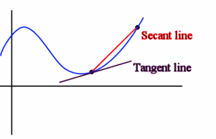

---
We live in a 3-dimensional world, defined by **length, width, and depth**.

If we step down a dimension to 2-D, we lose depth—now we only have **length and width**.

Drop down again to 1-D, and we're left with just length—a single line stretching across space.

But what about the *0th dimension*?

That's just a point—an object with **no** length, width, or depth. It has position, but no size.

Now, think about **instantaneous change**—like the speed shown on a car's speedometer. It tells you how fast you're going at **a single instant** in time, not over a stretch.

This is the calculus version of a point: a single moment on the graph. Just as a 0-D point captures one position in space, **instantaneous rate of change** captures a single moment of change in a function—no interval, no span, just the slope at exactly one point.

This concept forms the foundation of **calculus** and much of **physics**.

---

# Average Rate of Change (AROC)

In previous math courses, we've discussed the average slope—also known as the **average rate of change**. This measures how much a function changes **on average** over a given interval.

You might remember the slope formula from algebra:

$$
m = \frac{y_2 - y_1}{x_2 - x_1}
$$

In calculus, we deal with functions, so we generalize it to:

$$
m = \frac{f(b) - f(a)}{b - a}
$$

This is the **average rate of change** of a function $f(x)$ over the interval $[a, b]$.

It can also be visualized as the slope of a **secant line**—a line that intersects the curve at **two** distinct points.

The image above compares a **secant line** and a **tangent line**.  
- A **secant line** intersects the curve at two points and represents the **average rate of change** (slope) over an interval.  
- A **tangent line** touches the curve at exactly **one point** and represents the **instantaneous rate of change** at that point.

## Example 1  
Find the average rate of change of $f(x) = 2x^2 - 3x + 7$ on the interval $[-2, 4]$.

**Step 1: Recall the formula**

$$
m = \frac{f(b) - f(a)}{b - a}
$$

**Step 2: Plug in values**

$$
m = \frac{f(4) - f(-2)}{4 - (-2)} = \frac{27 - 21}{6}
$$

**Step 3: Simplify**

$$
m = \frac{6}{6} = 1
$$

So, the **average rate of change** is:

$$
\boxed{m = 1}
$$

---

# Instantaneous Rate of Change

The **instantaneous rate of change** is the **exact** rate at which a function is changing at a **single point** in time.  

Think of a speedometer—it shows how fast you're going **right now**, not over the last mile.

This is found using the **slope of the tangent line** to the curve at a specific point.

A **tangent line** touches a curve at exactly **one point** and has the **same slope** as the curve at that point.

---

Up next we will discuss how to find the slope of a tangent line.
