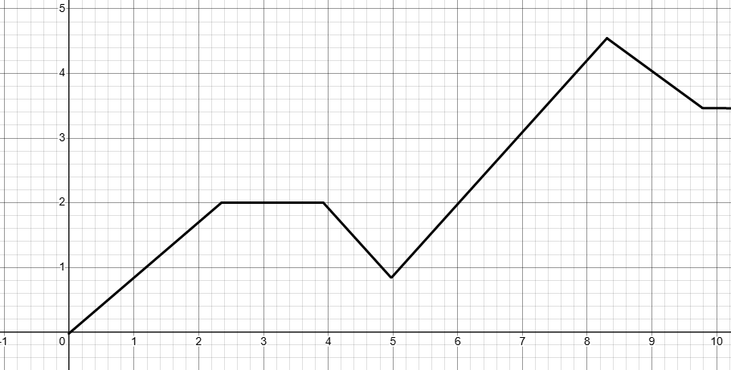

---
## What Is a Limit?

A **limit** is the value a function approaches as the input approaches some value.

Imagine you're walking toward a wall. You take half the remaining distance with each step.  
You’ll never technically *reach* the wall—but you'll get infinitely close.  
In math, we call the value you’re approaching the **limit**.

Limits allow us to handle situations where a function might not be defined at a point, but we still want to know what it’s "heading toward" as we get close.

---

## Formal Notation

We write the limit of a function $f(x)$ as $x$ approaches a value $a$ like this:

$$
\lim_{x \to a} f(x)
$$

This reads as:  
> "The limit of $f(x)$ as $x$ approaches $a$"

This limit equals $L$ if:

$$
\lim_{x \to a} f(x) = L
$$

means that as $x$ gets arbitrarily close to $a$, $f(x)$ gets arbitrarily close to $L$.

---

## One-Sided Limits

Sometimes, the function behaves differently from the left and the right.

- **Left-hand limit**:
  $$
  \lim_{x \to a^-} f(x)
  $$
- **Right-hand limit**:
  $$
  \lim_{x \to a^+} f(x)
  $$

If **both** one-sided limits exist and are equal, then the **two-sided limit** exists and equals that value.

---

## Visual Example

Imagine a graph that approaches 2 from both the left and the right as $x \to 3$:

In this case:

$$
\lim_{x \to 3^-} f(x) = 2 \quad \text{and} \quad \lim_{x \to 3^+} f(x) = 2
$$

Therefore:

$$
\lim_{x \to 3} f(x) = 2
$$

---

## Example 1

Evaluate:

$$
\lim_{x \to 1} (3x + 2)
$$

**Step 1: Plug in $x = 1$ directly:**

$$
3(1) + 2 = 5
$$

**Step 2: Since it’s a polynomial and continuous, the limit equals the value.**

$$
\boxed{\lim_{x \to 1} (3x + 2) = 5}
$$

---

## Example 2 (Removable Discontinuity)

Let:

$$
f(x) = \frac{x^2 - 1}{x - 1}
$$

Evaluate:

$$
\lim_{x \to 1} f(x)
$$

**Step 1: Factor numerator:**

$$
\frac{(x - 1)(x + 1)}{x - 1}
$$

**Step 2: Cancel out $(x - 1)$:**

$$
f(x) = x + 1 \quad \text{for } x \ne 1
$$

**Step 3: Now plug in $x = 1$:**

$$
\lim_{x \to 1} f(x) = 1 + 1 = \boxed{2}
$$

Even though $f(1)$ is undefined, the **limit exists**.

---
## Limit Notation Summary

- $\lim_{x \to a} f(x)$ → Two-sided limit
- $\lim_{x \to a^-} f(x)$ → Left-hand limit
- $\lim_{x \to a^+} f(x)$ → Right-hand limit

When:

$$
\lim_{x \to a^-} f(x) = \lim_{x \to a^+} f(x) = L
$$

Then:

$$
\lim_{x \to a} f(x) = L
$$
---
## Key Takeaways

- A **limit** is the value a function approaches, not necessarily the value it reaches.
- Use **one-sided limits** when behavior differs from left vs. right.
- If both one-sided limits exist and are equal, the two-sided limit exists.
- If direct substitution leads to $\frac{0}{0}$, **simplify** the expression to remove discontinuities.

---

## What’s Next

In the next lesson, we’ll explore how to **evaluate limits graphically** even when substitution fails.
