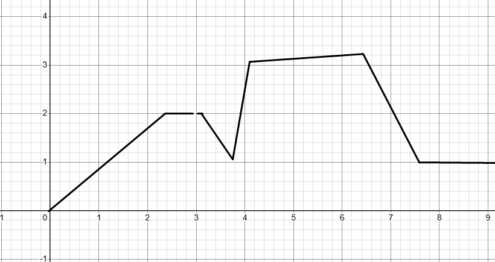
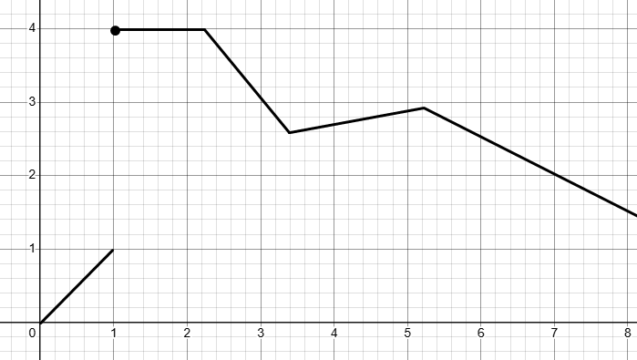
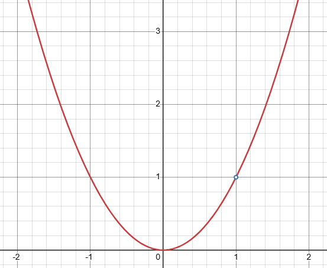

---
## What Does a Graph Tell Us About Limits?

A graph is one of the **most powerful tools** for estimating limits.  
It visually shows us what value a function is approaching as $x$ approaches a specific number.

Let’s say you're watching a car approach a stop sign. You might not know its exact speed, but by seeing it slow down and glide toward the stop, you can **estimate** how fast it's going just before stopping. That’s the visual idea behind limits.

---

## Understanding with Left and Right Approaches

To estimate $\lim_{x \to a} f(x)$ from a graph:

- Look at how the graph behaves as $x$ approaches $a$ **from the left** (denoted $x \to a^-$)
- Then look at how it behaves as $x$ approaches $a$ **from the right** ($x \to a^+$)

If both sides approach the same $y$-value, then the limit exists and equals that value.

---

## Example 1

From the graph above, as $x$ approaches $3$:

- From the left: $f(x) \to 2$
- From the right: $f(x) \to 2$

So:

$$
\lim_{x \to 3} f(x) = 2
$$

Even if $f(3)$ is undefined or $f(3) \ne 2$, the limit is still **2**.  
Remember: **limits care about approach, not arrival**.

---

## Visual Clues to Watch For

✅ The graph **settles toward a single height** on both sides of $x = a$ → limit exists  
❌ If the left and right sides **go to different heights**, the limit **does not exist**

---

## Example 2: Jump Discontinuity

Here, as $x \to 1$:

- From the left: $f(x) \to 1$
- From the right: $f(x) \to 4$

Since the two sides approach **different values**, we say:

$$
\lim_{x \to 1} f(x) \text{ does not exist}
$$

This is called a **jump discontinuity**.

---

## Quick Notation Summary

- Left-hand limit:
  $$
  \lim_{x \to a^-} f(x)
  $$

- Right-hand limit:
  $$
  \lim_{x \to a^+} f(x)
  $$

- Two-sided limit (exists only if left = right):
  $$
  \lim_{x \to a} f(x)
  $$

---

## Example 3: Hole in the Graph

Let:

$$
f(x) = \begin{cases}
x^2 & \text{if } x \ne 1 \\
\text{undefined} & \text{if } x = 1
\end{cases}
$$

Even though there’s a **hole** at $x = 1$, as $x$ approaches 1 from both sides, the $y$-value approaches 1.

So:

$$
\lim_{x \to 1} f(x) = 1
$$

This is an example of a **removable discontinuity**.

---

## Key Takeaways

- You can estimate limits by **tracing a graph** from the left and right.
- If both sides **agree**, the limit exists—even if the point is missing or undefined.
- If they **disagree**, the limit **does not exist**.
- Visual cues like **jumps** or **holes** are key to understanding limit behavior.

---

## What’s Next

Next, we'll explore **estimating limits numerically**, using tables to approximate the function’s behavior near a point.
